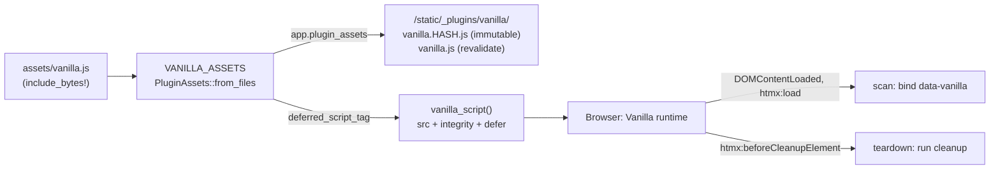

# ADR 0001: One `vanilla.js` file, served through `plugin_assets`

- Status: accepted
- Date: 2026-10-05
- Applies to: autumn-plugin-vanilla 0.1.0, autumn-web 0.8.0

## Context

Autumn apps need small client behaviors. The default CSP is
`script-src 'self'`, so inline scripts do not run. autumn-web 0.8.0 adds
`PluginAssets` and `AppBuilder::plugin_assets`. The seam serves a plugin's
files under `/static/_plugins/<namespace>/` with hashed, immutable URLs,
`ETag`/`304`, `Range` and computed SRI. `autumn-plugin-motion` 0.2 uses it.

## Decision

- Make one bundle, `VANILLA_ASSETS`, with namespace `vanilla`.
- Put the runtime and all built-in behaviors in one file, `vanilla.js`.
- Make the bundle with `PluginAssets::from_files` and `include_bytes!`. This
  does not force the `embed-assets` feature on the host app.
- `VanillaPlugin::build` calls `app.plugin_assets(&VANILLA_ASSETS)`.
- `vanilla_script()` calls `VANILLA_ASSETS.deferred_script_tag("vanilla.js")`.
- Do not wrap Alpine.js or Stimulus. They need `unsafe-eval` or a build step.

## Consequences

- No hand-kept hashes. An edit to `vanilla.js` gets a new URL.
- One request loads all behaviors. The file is small, so this is acceptable.
- An app adds its own behaviors with `Vanilla.register` in a same-origin file.
- Requires autumn-web `0.8`.
